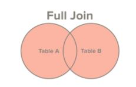
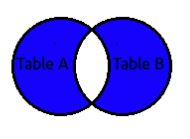

# Full Join or Full Outre Join

- **Both Full Join and Full outer join is same.**
- Select all records from Table A and Table B, regardless of whether the join condition is met or not.
- List all the records from both tables. Populate column values with if they are not present in another table.
- If no joining records are found, only distinct records which are not present in another table will be returned.

> select first_name, last_name, order_date, order_amount
  from customers c
  full join orders o
  on c.customer_id = o.customer_id
  
##### For our example result will be:

first_name | last_name | order_date | order_amount
---------- | --------- | ---------- | ------------
George | Washington | 07/04/1776 | $234.56
Thomas | Jefferson | 03/14/1760 | $78.50
John | Adams | 05/23/1784 | $124.00
Thomas | Jefferson | 09/03/1790 | $65.50
NULL | NULL | 07/21/1795 | $25.50
NULL | NULL | 11/27/1787 | $14.40
James | Madison | NULL | NULL
James | Monroe | NULL | NULL

> This is used to get only non joining records from both tables
>
> select first_name, last_name, order_date, order_amount
    from customers c
    full join orders o
    on c.customer_id = o.customer_id where first_name is NULL or order_date is null

##### For our example result will be:
  
first_name | last_name | order_date | order_amount
---------- | --------- | ---------- | ------------
Thomas | Jefferson | 09/03/1790 | $65.50
NULL | NULL | 07/21/1795 | $25.50
NULL | NULL | 11/27/1787 | $14.40
James | Madison | NULL | NULL
James | Monroe | NULL | NULL