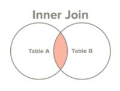

# Inner Join

- Select all records from Table A and Table B, where the join condition is met

> select first_name, last_name, order_date, order_amount
from customers c
inner join orders o
on c.customer_id = o.customer_id

##### For our example result will be:

first_name | last_name | order_date | order_amount
---------- | --------- | ---------- | ------------
George | Washington | 07/4/1776 | $234.56
John | Adams | 05/23/1784 | $124.00
Thomas | Jefferson | 03/14/1760 | $78.50
Thomas | Jefferson | 09/03/1790 | $65.50