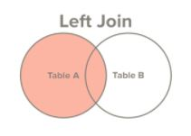
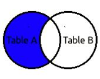

# Left Join or Left Outer Join

- **Both Left Join and Left outer join is same.**
- Select All records from Table A, along with records for Table B for which join condition is met(if at all)
- If no joining records are found in right table, it will return rows only from left table.
 

> select first_name, last_name, order_date, order_amount
  from customers c
  left join orders o
  on c.customer_id = o.customer_id
  
  ##### For our example result will be:
  
  first_name | last_name | order_date | order_amount
  ---------- | --------- | ---------- | ------------
  George | Washington | 07/04/1776 | $234.56
  John | Adams | 05/23/1784 | $124.00
  Thomas | Jefferson | 03/14/1760 | $78.50
  Thomas | Jefferson | 09/03/1790 | $65.50
  James | Madison | NULL | NULL
  James | Monroe | NULL | NULL
  
  
  

> This is used to get only non joining records from left table.
>
> select first_name, last_name, order_date, order_amount
  from customers c
  left join orders o
  on c.customer_id = o.customer_id where order_date is NULL

  ##### For our example result will be:
  
  first_name | last_name | order_date | order_amount
  ---------- | --------- | ---------- | ------------
  James | Madison | NULL | NULL
  James | Monroe | NULL | NULL

