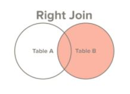
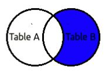

# Right Join or Right Outer Join

- **Both Right Join and Right outer join is same.**
- Select All records from Table B, along with records for Table A for which join condition is met(if at all)
- If no joining records are found in left table, it will return rows only from right table.

> select first_name, last_name, order_date, order_amount
  from customers c
  right join orders o
  on c.customer_id = o.customer_id
  
first_name | last_name | order_date | order_amount
---------- | --------- | ---------- | ------------
George | Washington | 07/04/1776 | $234.56
Thomas | Jefferson | 03/14/1760 | $78.50
John | Adams | 05/23/1784 | $124.00
Thomas | Jefferson | 09/03/1790 | $65.50
NULL | NULL | 07/21/1795 | $25.50
NULL | NULL | 11/27/1787 | $14.40

> This is used to get only non joining records from right table
>
> select first_name, last_name, order_date, order_amount
  from customers c
  right join orders o
  on c.customer_id = o.customer_id
  where first_name is NULL
  
first_name | last_name | order_date | order_amount
---------- | --------- | ---------- | ------------
NULL | NULL | 07/21/1795 | $25.50
NULL | NULL | 11/27/1787 | $14.40
